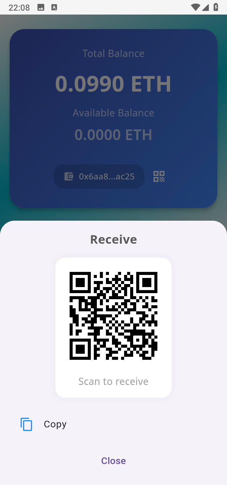
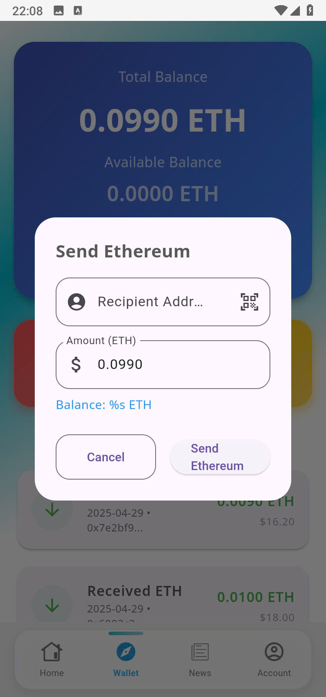

# 🚀 CryptoApp – Flutter D-App Wallet & Crypto Platform

## 📱 Introduction

**CryptoApp** is a powerful Flutter-based mobile application that integrates a decentralized wallet (D-App Wallet), real-time crypto price tracking with WebSocket, AI-powered predictions and analysis, multilingual support, and up-to-date news from the crypto world.

Designed for both beginner and advanced crypto enthusiasts, CryptoApp provides a seamless user experience with a modern interface and essential features to explore the cryptocurrency space.

---

## 🧩 Features

- 🔐 **D-App Ethereum Wallet**
    - View and manage your ETH balance and tokens
    - Secure, local storage of private keys
    - Multiple wallet management
    - Transaction history

- 📈 **Real-Time Price Tracking (WebSocket)**
    - Live coin prices
    - Price chart visualization
    - Market statistics
    - Coin search and filtering

- 🤖 **AI Analysis & Prediction**
    - Evaluate coins using AI
    - Predict potential trends and movements
    - Personalized recommendations

- 📰 **Crypto News Feed**
    - Daily curated news from the blockchain world
    - Read articles inside the app
    - Bookmark and share news

- 🌍 **Multilingual Support**
    - Easily switch between different languages
    - Currently supports English and Vietnamese

- 🔎 **Search & Discovery**
    - Find and explore coins by name, rank, or category
    - View detailed coin information

- ⚙️ **User Account System**
    - Register, login, manage account
    - Profile settings
    - Custom preferences

- 🛠 **Admin Dashboard**
    - Manage users
    - Monitor transactions
    - Control and apply gas fee discounts
    - Ensure system integrity

---

## 🖼 Screenshots

### 👋 Welcome Screens

| Welcome 1 | Welcome 2 | Welcome 3 |
|-----------|-----------|-----------|
|  |  |  |

### 🔐 Authentication

| Login | Register |
|-------|----------|
|  |  |

### 🏠 Main Interface

| Home | Detail Coin | Search |
|------|-------------|--------|
|  |  |  |

### 📰 News

| News |
|------|
|  |

### 🤖 AI Analysis

| AI Evaluation |
|---------------|
|  |

### 👤 User Profile

| Account Info 1 | Account Info 2 | Settings |
|----------------|----------------|----------|
|  |  |  |

### 💼 Wallet

| Wallet 1 | Wallet 2 |
|----------|----------|
|  |  |

| Wallet 3 | Wallet 4 |
|----------|----------|
|  |  |

### 🛡 Admin Panel

| Admin - Users | Admin - Transactions | Admin - Gas Fee |
|---------------|----------------------|-----------------|
|  |  |  |

---

## 🚀 Technologies Used

### 💡 Core
Flutter, Cubit (flutter_bloc), get_it

### 🌐 Networking
Dio, Retrofit, Freezed, Json Serializable

### 🌍 Localization
easy_localization

### 🔔 Firebase
Core, Auth, Messaging, Firestore, Local Notifications

### 📊 UI & Animation
Lottie, Animate_do, Shimmer, Intro Screen, Carousel, Charts

### 🖼️ Media
Image & File Picker, Cached Image, Video Player, Photo View, Share

### 🔐 Crypto / DApp
web3dart, bip39, ed25519, hex, QR Scanner

### ⚙️ Utilities
Shared Prefs, Connectivity, Dotenv, Permissions, URL Launcher, Emoji, Ads, Toast

---

## 💡 Future Plans

- Add token swap/trade functionality
- Push notifications for coin alerts
- NFT wallet support
- Dark mode
- Admin analytics dashboard

---

## 🙌 Contribution

Feel free to fork this repo, make changes, and create a pull request. All contributions are welcome!

---

## 📧 Contact

- Author: **Nguyễn Minh Duy**
- Phone: +84 916 267 402
- Website: [https://minhduyy.id.vn/](https://minhduyy.id.vn/)
- Facebook: [https://www.facebook.com/duy.nguyenminh.56679/](https://www.facebook.com/duy.nguyenminh.56679/)
- Email: minhduyy4167@gmail.com
- GitHub: [github.com/minhduy68](https://github.com/minhduy6868)

